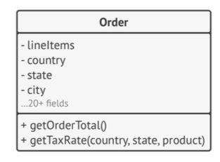
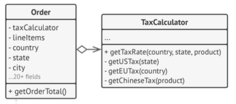
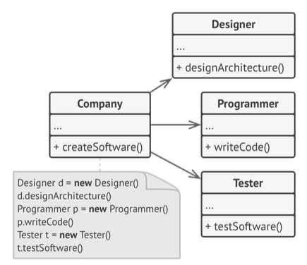
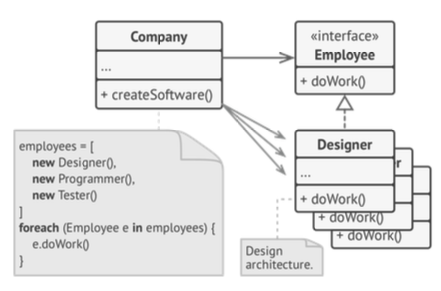
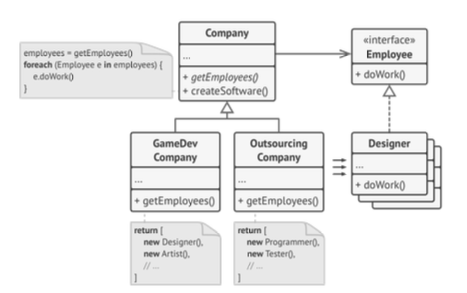

what is good software design? how we mesasure it?
## Encapsulate what vaires
### Encapsulations on function level
In the below example `getOrderTotal` tax calculating part can change in the future (based on supporting another countries) but the rest of the function has a lower chance for changes.
```Swift
func getOrderTotal(order) -> Double {
	var total = 0  
	for item in order.lineItems {
	    total += item.price * item.quantity
	}
	if order.country == "US" { 
		total += total * 0.07 // US sales tax
	}else if order.country == "EU" {
		total += total * 0.20 // European VAT
	}
	return total
}
```
so we extract tax calculation into another function.
```Swift
func getOrderTotal(order) {
var total = 0  
for item in order.lineItems {
	total += item.price * item.quantity 
	total += total * getTaxRate(order.country) 
}
return total
}

func getTaxRate(country) {
	if country == "US" {
		return 0.07 
	else if country == "EU" {
		return 0.20 
	} else {
		return 0
	}
}
```
### Encapsulations on class level
It's better to seperate classes to have less responsibility and their purpose become more underestandable.
**Example:**
* before:

* after:

## Program to an Interface, not an Implementation
Same good old rule of depend on interfaces instead of concreate classes.
here is a nice 3 step refactor that final result demonstrate somhow the factory method pattern.



## Favor Composition Over Inheritance
Problems of inheritence listed in the [[Pilars of OOP]]. so It's better to always consider compositon before inheritance. inheritance represents the “is a” relationship between classes (a car is a transport), composition represents the “has a” relationship (a car has an engine).
**Example:**
* inheritance hell

* We can solve this problem with composition. I**nstead of car objects implementing a behavior on their own, they can delegate it to other objects.**
