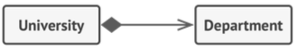
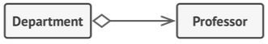

## Associations
on object uses or interacts with another.

## Dependency
is a weaker varient of association. There is no permenant link between objects. We usually pass an object to another object. (through methods or initializers.)

## Composition
one of a object composed of one or more instances of another.

## Aggregation
less strict form of composition where one object contains a **reference** to another. the **container doesn't control the life cycle of the component** and **component can exists without container**.

