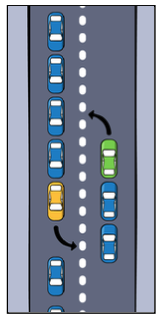

* Race conditions  
* Deadlock  
* Priority inversion
# Race Conditions
Happens when threads that share the same process trying to read and write to the same shared resource.

accessing count in not safe from different threads
```Swift
class Counter {
	public var count = 0 //🔴 possibility of data races
	func increament() {
		count += 1
	}
	func decreament() {
			count -= 1
	}
}
```

There are several methods to fix this:
* [Actors](../Modern%Concurency/Actors.md) 
* Locks: like [NSLock](https://developer.apple.com/documentation/foundation/nslock), (more ?)
* Serial `DispatchQueues` example below:
```Swift
class Counter {
	private let threadSafeCountQueue = DispatchQueue(label: "...")
	private var _count = 0
	public var count: Int {
	  get {
	    return threadSafeCountQueue.sync {
			_count 
	}
	} set {
	    threadSafeCountQueue.sync {
	      _count = newValue
	    }
	} }
}
```
Note: *For more complex state handling we can use **Thread barrier** `threadSafeCountQueue.async(flags: .barrier)` (more detail in the book)*

## Deadlocks
Happens when in an asynchronous code resources are depended on each other.

TODO: Operation dependency example

## Priority inversion
> Priority inversion occurs when a queue with a lower quality of service is given higher system priority than a queue with a higher quality of service.

Example:
Task A -> `.userInitiated`
Task B -> `.utility`

Task C, Task D, Task F -> `.usertInteractive`

We submit C D and F to Task B. System may increase the priority of Task B even higher than task A.

This is simple to avoid: **If you need a higher quality of service, use a different queue**
or in other words don't submit tasks with high Qos to Dispatchqueues with lower Qos.