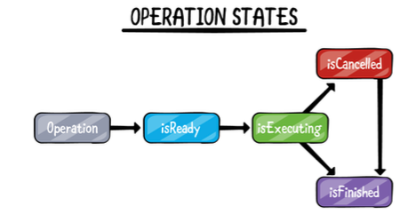

* Operations are built on top of GCD
* Operations allow for greater control over the submitted task.
* One of the first reasons you’ll likely want to create an Operation is for reusability (Operation is a Swift object) 

## Operation states

* *The state machine is a get only. However we can set the sate to `isExectuting` by calling starting operation and set the state to `isCancelled` by calling `cancel()`*
## BlockOperation
```Swift
let operation = BlockOperation {
 print("Hello World!")
}
```
* A BlockOperation manages the **concurrent** execution of one or more closures on the default global queue.
* BlockOperation manages a **group of closures**. `blockOperation.addExecutionBlock {...}`
* Acts similar to a dispatch group in that it **marks itself as being finished** when all of the closures have finished. `blockOperation.completionBlock { ... }`
