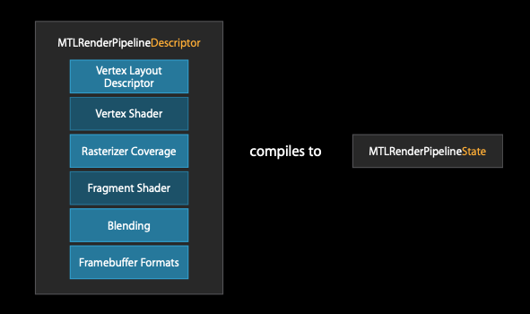
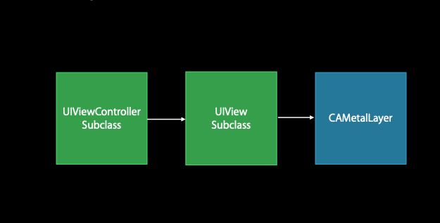

## Building a Metal Application (Initialization)
1) Get the device
2) Create a CommandQueue
3) Create Resources (Buffer and textures)
4) Create RenderPipelines
5) Create a View

## Render Pipeline Descriptors

* The **render pipeline** holds all of the directions necessary to your shape on the screen.
* **The render pipeline descriptors** all of the configurations api
* The render pipeline descriptors baked to **Render pipeline state**
* 

## Metal View
if we want to get anything on screen it needs to be part f CoreAnimation tree, in metal it is CAMetalLayer


## Building a Metal Application (Drawing)

1) Get a command buffer
2) start a Render pass
3) Draw
4) Commit in the command buffer

* ***Render passes** are the mechanism for composing a scene.
* Connect core animation and metal (notification from metal to core animation)
```Swift
commandBuffer?.present(drawable)
```