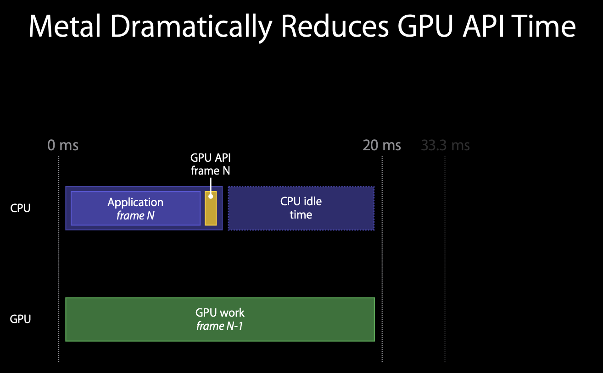
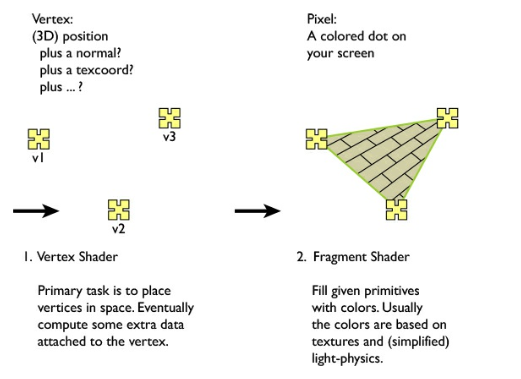

## Why Metal?
* More draw calls: more stuff on the screen
* Deep Integration: OpenGl and other things don't have it
* Key Design of Metal:
	* Thinnest Possible API
	* Modern GPU Features
	* Do expensive less often
	* predictable Performance
	* Explicit Command submission
	* Optimized for CPU behavior
* Your App -> Middelware -> GPU
	* Middleware can be sceneKit, core animations, OpenGL
* 
* Balanced and Unbalanced works of CPU and GPU (idle GPU)
	* 
	* 
	* 
* Why GPU programming is expensive
	* state validation
	* shaders completion
	* sending work to GPU
	* 

## Metal Objects
* Device : abstraction of GPU
* Command Queue: Serial sequence of command buffers
* Command Buffer: contains GPU hardware commands
* Command Encoder: API Commands to GPU hardware commands
* State: series of state objects (Framebuffer configurations)
* Code: Shaders
* Resources: Textures and Data Buffers (vertices, constants)

## Encoders
### Render command encoder
Graphic rendering,
generates hardware commands for single render pass
state of vertex and fragments
### Compute command encoder
Data parallel computations
### Blit command encoder
asynchronous copies of data buffers

## Shading Language
* Based on C++11
*  + GPU hardware features + Functaion oading and templates
* Data types if graphics computer features (Scalar, vector, matrix types)
* Attribuites Metal API -> Metal Shading language
* Setup Encoder with api and refer to those in shader functions
* 
* 
* shader built at compile. time no need to ship with application
* warning and errors
* 
