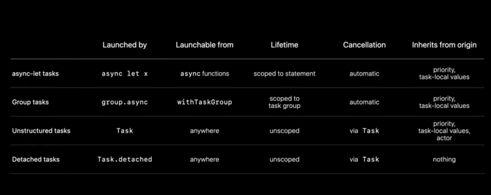

* 🟢 Structured Tasks: `async let` and `TaskGroup`
	leave until the scope exists and cancel when they get out of scope
* 🟡 Unstructured Tasks: `Task` and `Task.detached`

Prefer structured concurrency over unstructured concurrency whenever is possible

Assume we have 3 concurrent task `getFoo`, `getBar`, `getZee`
instead of using unstructured concurrency:
``` Swift
let foo = Task { try await getFoo() } 
let bar = Task { try await getBar() } 
let zee = Task { try await getZee() } 
```
It's better to use Structured concurrency:
```Swift
async let foo = try await getFoo()
async let bar = try await getBar()
async let zee = try await getZee()
```
* They will have a **structured relationship** with their parent tasks which is important when we want to instrument and debugging or cancelling them.

## Flavors of Tasks
