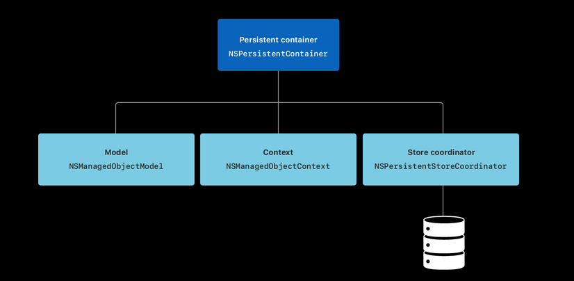

## Fundamentals
## Networking
using url components
```Swift
var components = URLComponents()
components.scheme = "https"
components.host = "api.github.com"
components.path = "/users/johnsundell"

// This will give us the constructed URL as an optional
let url = components.url
```

write the **DTO** as a nested struct in an extension of our entity
```Swift
struct User: Identifiable, Codable {
    let id: UUID
    var name: String
    var twitterHandle: String
    var gitHubUsername: String
}

extension User {
    struct NetworkResponse: Codable {
        var result: User
    }
}
```

Badass generic networking implementation:
[Link](https://www.swiftbysundell.com/articles/creating-generic-networking-apis-in-swift/)

`URLProtocol` used for integration test with the **UrlsSession**

## TESTING
`XCTUnwrap` for checking the value if its nil or nota

## COMBINE
observing a combine publisher directly in SwiftUI view
```Swift
extension View {
    func onNotification(
        _ notificationName: Notification.Name,
        perform action: @escaping () -> Void
    ) -> some View {
        onReceive(NotificationCenter.default.publisher(
            for: notificationName
        )) { _ in
            action()
        }
    }
}


```

```Swift
struct AnimationView: View {
    @State private var isAnimating = true

    var body: some View {
        VStack {
            ...
        }
        .onAppEnteredBackground {
    isAnimating = false
}
    }
}
```

### Handy modifiers
setFailureType()
share()

### Subjects
PassthroughSubject: Values not emitted until a subscribers start listen to it
CurrentValueSubject: Values emitted before listening

## CoreData



-   An instance of [`NSManagedObjectModel`](https://developer.apple.com/documentation/coredata/nsmanagedobjectmodel) represents your app’s model file describing your app’s types, properties, and relationships. 
-   An instance of [`NSManagedObjectContext`](https://developer.apple.com/documentation/coredata/nsmanagedobjectcontext) tracks changes to instances of your app’s types. 
-   An instance of [`NSPersistentStoreCoordinator`](https://developer.apple.com/documentation/coredata/nspersistentstorecoordinator) saves and fetches instances of your app’s types from stores.
-   An instance of [`NSPersistentContainer`](https://developer.apple.com/documentation/coredata/nspersistentcontainer) sets up the model, context, and store coordinator all at once.


using core data directly in swiftUI views
```swift
@Environment(\.managedObjectContext) private var viewContext
```

```swift
@FetchRequest(entity: Order.entity(), sortDescriptors: [], predicate: NSPredicate(format: "status != %@", Status.completed.rawValue))
```

Observe CoreData changes using combine

```Swift
NotificationCenter.default.publisher(

                for: NSManagedObjectContext.didMergeChangesObjectIDsNotification,

                object: _context)

            .sink { notification in

                if let updated = notification.userInfo?[NSUpdatedObjectIDsKey] as? Set<NSManagedObjectID>,

                   updated.contains(managedObject.objectID),

                   let updatedObject = _context.object(with: managedObject.objectID) as? T {

                    updated.first { id in

                    }

                    return perform(updatedObject)

                }

            }.store(in: &cancellables)
```

