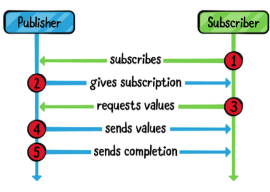

*These are some theoretical details that not really important in real world but can be used as a interview question or knowledge show-offs*
## Publisher
Publisher protocol defines the requirements for a type to be able to transmit a sequence of values over time to one or more subscribers.
A publisher can emit zero or more values but only one completion event, which can either be a **normal completion** event or an **error**. Once a publisher emits a completion event, it’s finished and can no longer emit any more events.
## Subscriber
Subscriber is a protocol that defines the requirements for a type to be able to receive input from a publisher.
**A publisher only emits an event when there’s at least one subscriber.**
The `sink` operator will continue to receive as many values as the publisher emits. (This is known as unlimited demand)
## Cancellable
Subscriptions return an instance of AnyCancellable as a cancellation token, which makes it possible to cancel the subscription when you’re done with it.
## Subscription
The connection between the publisher and the subscriber is the subscription.
## How Publishers and Subscribers work together

## Future
A Future is a publisher that will eventually produce a single value and finish, or it will fail.
## Subjects
* `CurrentValueSubject`
* `PassthroughSubject`