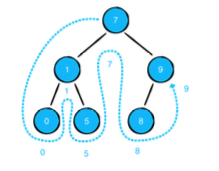
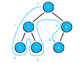
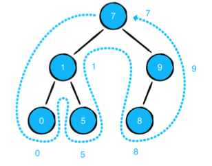

# Binary Trees
A tree which every node has exactly two child, left and right
```Swift
public class BinaryNode<Element> {

	public var value: Element
	public var leftChild: BinaryNode?
	public var rightChild: BinaryNode?

	public init(value: Element) {
	    self.value = value
	}
}
```

## Binary Tree Traversal algorithms

### In-order traversal (LCR)

```Swift
public func traversInOrder(visit: (TreeNode) -> Void) {
	letfChild?.traversInOrder(visit)
	visit(self)
	rightChild?.traversInOrder(visit)
}
```
### Pre-order traversal (CLR)

```Swift
public func traversPreOrder(visit: (TreeNode) -> Void) {
	visit(self)
	letfChild?.traversPreOrder(visit)
	rightChild?.traversPreOrder(visit)
}
```
### Post-order traversal (LRC)

```Swift
public func traversPostOrder(visit: (TreeNode) -> Void) {
	letfChild?.traversPostOrder(visit)
	rightChild?.traversPostOrder(visit)
	visit(self)
}
```
### Height of binary tree
The algorithm is commonly being used in many places. The implementation is brief yet a bit complicated.
```swift
func height<T>(of node: BinaryNode<T>?) -> Int {
	guard let node = node else {
		return -1
	}
	
  return 1 + max(
		height(of: tree.leftChild),
		height(of: tree.rightChild))
}
```
## Binary Search Tree
It's a binary tree with this consideration.
* Every left node is smaller that its parent.
* Every right node is bigger that its parent
Time complexity of its search, insertion and deletion is O(log(n))
### Insertion
```swift
extension BinarySearchTree {

  public mutating func insert(_ value: Element) {
    root = insert(from: root, value: value)
  }
  
  private func insert(from node: BinaryNode<Element>?, value:
Element)
      -> BinaryNode<Element> {
      //end of recursion
    guard let node = node else {
      return BinaryNode(value: value)
    }
    
	//perform recursion based on comparing
    if value < node.value {
      node.leftChild = insert(from: node.leftChild, value:
value)
	} else {
      node.rightChild = insert(from: node.rightChild, value:
value)
	}
	return node 
	}
}
```
* With this insertion It's possible to create **unbalanced** trees, that may result in the lack of good performance or even have the same performance as an array (when there is only one branch in tree) this has been addressed in:
### Find an element
It's not based on recursion!
```swift
public func contains(_ value: Element) -> Bool {
	var current = root
	while let node = current {
	    if node.value == value {
			return true
		}
	    if value < node.value {
	      current = node.leftChild
		} else {
	      current = node.rightChild
	    }
	}
	return false
}
```
### Deletion
There are three possibilities when you trying to delete a node
1) Node has no children (ie leaf): node can be simply removed
2) Node has one child: node can be removed but it's required to connect its child to the rest of the tree
3) Node has two children: It's more complicated ...
Check out the original book for more info.

## AVL Trees
AVL trees are balanced trees which assure that insertion or deletion or search always will happen in a performant way because the nodes are distributed in a more balanced way. Here's how balance factor for each node is calculated:
```swift
public var balanceFactor: Int {
  leftHeight - rightHeight
}

public var leftHeight: Int {
  leftChild?.height ?? -1
}

public var rightHeight: Int {
  rightChild?.height ?? -1
}
```
If a balance factor for a node is equal or greater that 2 it's required to balance that node. There are four types of rotations which help in balancing nodes.
### Balancing
#### Left Rotation
Make left side heavier 
![[avl-leftrotation.png]]
```swift
private func leftRotate(_ node: AVLNode<Element>)
  -> AVLNode<Element> {
  
	let pivot = node.rightChild!
	node.rightChild = pivot.leftChild
	pivot.leftChild = node
	
	node.height = max(node.leftHeight, node.rightHeight) + 1
	pivot.height = max(pivot.leftHeight, pivot.rightHeight) + 1
}
```
#### Right Rotation
Make right side heavier 
![[avr-rightrotation.png]]
```swift
private func leftRotate(_ node: AVLNode<Element>)
  -> AVLNode<Element> {
  
	let pivot = node.left!
	node.leftChild = pivot.rightChild
	pivot.rightChild = node
	
	node.height = max(node.leftHeight, node.rightHeight) + 1
	pivot.height = max(pivot.leftHeight, pivot.rightHeight) + 1
}
```
#### Right-Left Rotation
![[avl-lrrotation.png]]
Should be considered for the nodes that have balance factor bigger than 2 but also all their child nodes **are not on the same side**.
```swift
private func rightLeftRotate(_ node: AVLNode<Element>)
  -> AVLNode<Element> {
	guard let rightChild = node.rightChild else {
		return node 
	}
  node.rightChild = rightRotate(rightChild)
  return leftRotate(node)
}
```
#### Right-Left Rotation
![[avrl-rlrotation.png]]
```swift
private func rightLeftRotate(_ node: AVLNode<Element>)
  -> AVLNode<Element> {
	guard let leftChild = node.leftChild else {
		return node 
	}
  node.leftChild = leftRotate(leftChild)
  return rightRotate(node)
}
```
### Balancing Algorithm
```swift
private func balanced(_ node: AVLNode<Element>)
  -> AVLNode<Element> {
	switch node.balanceFactor {
	//right side is heavier
		case 2:
		if let leftChild = node.leftChild,
			leftChild.balanceFactor == -1 {
				return leftRightRotate(node)
	    } else {
		      return rightRotate(node)
	    }
	    case -2:
		    if let rightChild = node.rightChild,
	           rightChild.balanceFactor == 1 {
			      return rightLeftRotate(node)
			} else {
				return leftRotate(node)
	    }
		default:
			return node 
	}
}
```
### AVL Insertion
It's similar BST insertion but each time that we insert we make sure that the tree is balanced.
```swift
private func insert(from node: AVLNode<Element>?,
                    value: Element) -> AVLNode<Element> {
	guard let node = node else {
		return AVLNode(value: value)
	}
	if value < node.value {
	    node.leftChild = insert(from: node.leftChild, value: value)
	} else {
	    node.rightChild = insert(from: node.rightChild, value:
value) 
	}
	let balancedNode = balanced(node)
	balancedNode.height = max(balancedNode.leftHeight,
balancedNode.rightHeight) + 1
	return balancedNode
}
```
