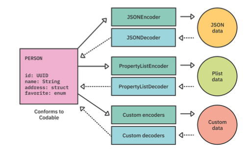
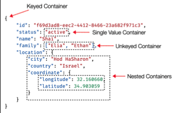

## Encode and Decode from different data types
We use abstractions like `Decoder` and `Encoder` which allow us to have different decoding and encoding implementations based on different data types like `Json` or `plist` .

## `JsonDecoder` Customization
``` Swift
decoder.keyDecodingStrategy = .convertFromSnakeCase
decoder.dataDecodingStrategy = .base64
decoder.dateDecodingStrategy = .formatted(dateFormatter)
```
adding a new custom decoding strategy
*see the original source for the complete implementation*
``` Swift
extension JSONDecoder.KeyDecodingStrategy {
  static var convertFromKebabCase: JSONDecoder.KeyDecodingStrategy = 
  .custom({ keys in
	//implemantations ....
}) 
}
```
## Custom Coding Initializers
First we need to write the init and then choose our coding container.
Different containers explained as below

* Single value container:
``` Swift
let container = try decoder.singleValueContainer()
let cost = try container.decode(String.self)
```
* Container by coding key
``` Swift
init(from decoder: Decoder) throws {
  let container = try decoder.container(keyedBy: CodingKeys.self)
  self.id = try container.decode(UUID.self, forKey: .id)
  //...
}

enum CodingKeys: String, CodingKey {
	case id
	//....
}
```
## `JsonEecoder` Output Customization
```Swift
encoder.outputFormatting = [.prettyPrinted, .sortedKeys, .withoutEscapingSlashes]
```
