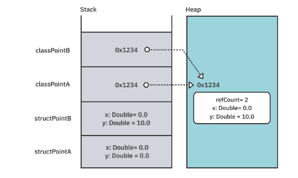

## The Funamental Types
* named types (protocols, enumerations, structures and classes)
* compound types (functions and tuples)

## Struct & Class Differences
### Difference 1: Automatic initialization
the compiler will declare an internal member-wise initializer for structures.
### Difference 2: Copy semantics
Classes = reference semantics
Structures = have value semantics.
```Swift
let structPointA = StructPoint(x: 0, y: 0)
var structPointB = structPointA
structPointB.x += 10
print(structPointA.x) // not affected, prints 0.0

let classPointA = ClassPoint(x: 0, y: 0)
let classPointB = classPointA
classPointB.x += 10
print(classPointA.x) // affected, prints 10.0
```
### Difference 3: Scope of mutation
### Difference 4: Heap versus stack
Stack allocations are orders of magnitude faster than heap allocations, this is where value types get their fast reputation.

### Difference 5: Lifetime and identity
Value types, generally live on the stack and are cheap to copy. Values don’t have the notion of a lifetime or intrinsic identity. References do have lifetimes.

## Protocols
### Limiting conformance of a protocol
```Swift
protocol LocalizableViewController where Self: UIViewController{
  func showLocalizedAlert(text: String)
}
```
### Static and dynamic dispatch
When Swift finds a **function** name, it jumps to the address of that function and starts executing the code. But jumping to a function’s address is **not always straightforward.**
two main mechanisms for storing and calling functions:
* **Static dispatch**: 
  happens when you know for sure that a function will never change.
  *global functions, methods declared in structs, methods on final classes.*
* **Static dispatch**:
  When you add pesky inheritance and protocols
 compiler can’t know ahead of time what the exact address of a function will be. Instead, it uses something called the witness table.
  
#### An Example about Static and dynamic dispatch in protocols
```Swift 
protocol Greetable {
  func greet() -> String
}

extension Greetable {
  func greet() -> String { "Hello" }
  func leave() -> String { "Bye"}
}

struct GermanGreeter: Greetable {
	func greet() -> String { "Hallo" }
	func leave() -> String { "Tschüss" }
}

let greeter: Greetable = GermanGreeter()
greeter.greet() //Hallo
greeter.leave() //Bye

```
extension methods rely entirely on **static** dispatch. There is no table involved in calling leave
