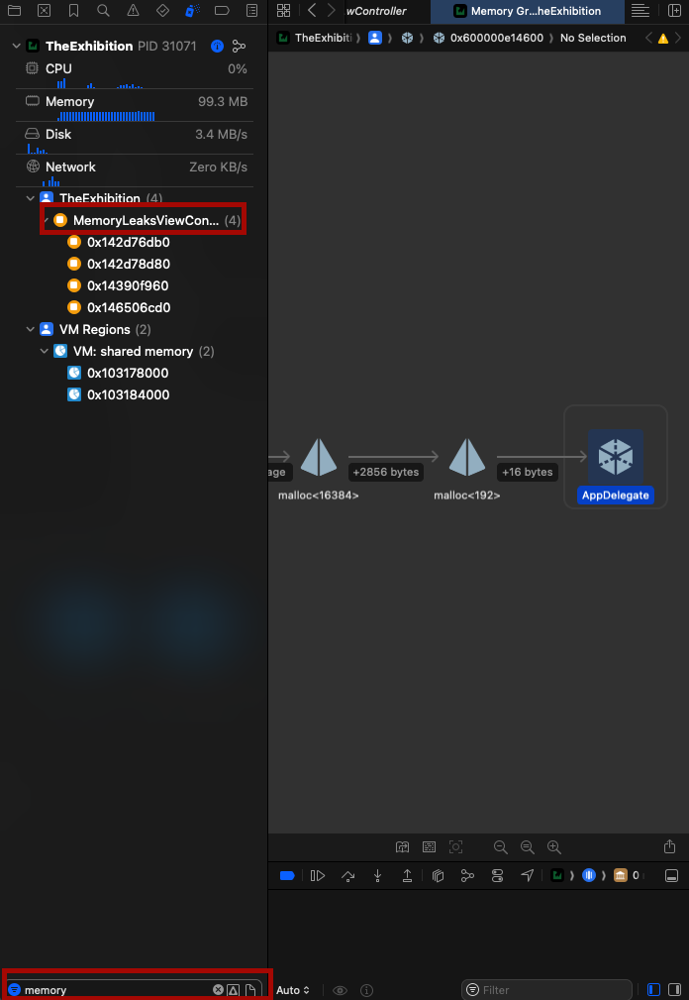
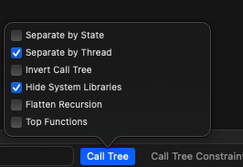

* Open instruments: `command + I`
## Allocations
For identify high memory usages
You may want to ignore all heap and allocations as it give you total allocations information.
For identifying what's causing high memory usage you need to look at what's come next after all heap and allocations.
`# Persistance` tells you how many objects allocation that category has.
## Leaks
For identifying where a memory leak happen
It may not show all of the leaks! you should pay attention to allocation and find potential leaks in projects.
**Memory graph** can be helpful in this situation
One of the easiest ways to find memory leaks in memory graph is search the name of the class that remains in memory in the right panel.

## Time profiler
For identifying high cpu usage
**Important point**: for profiling only your app cpu usage you want to change the call tree to something like this

You can find the exact name of functions and their cpu usages in the hierarchy 
## Data persistant
For detecting faults and disk read and writ
> Fault: when the app attempts to read an object from memory, because that’s the first location and has a higher I/O speed. However, that object is not present, so it automatically tries to read from another location — the disk, with a slower I/O speed. It then updates the first location with that information in case it was requested again.

One scenario that can happen is that you may want to prefetch core data relations into memory and avoid extra faults.
In order to have that you specify this property on your fetch request
```Swift 
request.relationshipKeyPathsForPrefetching =
  ["languages", "continent"]
```

## Build times
Check out tools that is introduced in [[Improve build time in Xcode]] 