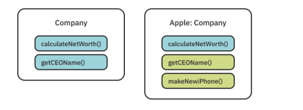

## Limiting conformance of a protocol
```Swift
protocol LocalizableViewController where Self: UIViewController{
  func showLocalizedAlert(text: String)
}
```
### Static and dynamic dispatch
When Swift finds a **function** name, it jumps to the address of that function and starts executing the code. But jumping to a function’s address is **not always straightforward.**
two main mechanisms for storing and calling functions:
* **Static dispatch**: 
  happens when you know for sure that a function will never change.
  *global functions, methods declared in structs, methods on final classes.*
* **Dynamic dispatch**:
  When you add pesky inheritance and protocols
 compiler can’t know ahead of time what the exact address of a function will be. Instead, it uses something called the witness table.
  
#### An Example about Static and dynamic dispatch in protocols
```Swift 
protocol Greetable {
  func greet() -> String
}

extension Greetable {
  func greet() -> String { "Hello" }
  func leave() -> String { "Bye"}
}

struct GermanGreeter: Greetable {
	func greet() -> String { "Hallo" }
	func leave() -> String { "Tschüss" }
}

let greeter: Greetable = GermanGreeter()
greeter.greet() //Hello
greeter.leave() //Bye

```
extension methods rely entirely on **static** dispatch. There is no table involved in calling leave.
## Multiple conformance
```Swift
func localizedGreet(with greeter: Greeter & Localizable)
```
we can compose a struct type with protocols (Date & Codable), a class type with protocols (UITableViewCell & Selectable) or multiple protocols.

## Conditional Conformance
```Swift
extension UITableViewDelegate where Self: UIViewController {
  func showAlertForSelectedCell(at index: IndexPath) { ... }
}
```
You can also drill down to extend generic types where their generic parameter conforms to a protocol
```Swift
extension Array where Element: Greetable {
  var allGreetings: String {
    self.map { $0.greet() }.joined()
  }
}
```
### Synthesized protocol conformance
like `Equatable` , `Hashable`, `Comparable`, `Codable`. By conforming to protocol like these swift will generate a synthesized protocol implementation for us.

## PAT
protocols with associated types (!)
[Swift Generics](../WWDC2022/Embrace%20%Swift%20Generics.md)