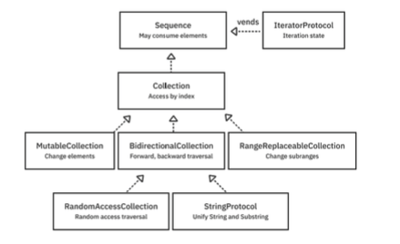

## Introduction


## Sequence
* **Sequence**: This is the most primitive type in the hierarchy that lets you iterate through a list of values. It makes **no guarantee about being able to revisit an item**. Although a conforming type could be a collection like an array, it could also be a stream of data from a network socket or a sequence of random numbers that never repeat. A type adopting Sequence can be immutable but must vend an associated mutable type that conforms to `IteratorProtocol`.
* **IteratorProtocol**: This behind-the-scenes protocol knows how to get the next element and returns nil when it’s done. It’s possible to use an iterator type directly, but usually, the compiler creates one for you when you use a `for` statement.
``` Swift
struct Countdown: Sequence {
  let start: Int
  func makeIterator() -> CountdownIterator {
    CountdownIterator(count: start)
  }
}

struct CountdownIterator: IteratorProtocol {
	var count: Int
	mutating func next() -> Int? {
	guard count>=0 else{
		return nil
    }
    defer { count -= 1 }
    return count
	} 
}
```
### More easier ways ...
*  Using AnySequence, AnyIterator. a **functional** implementation.
```Swift
let anotherCountdown5 = AnySequence<Int> { () -> AnyIterator<Int> in
  var count = 5
  return AnyIterator<Int> {
    defer { count -= 1}
    return count >= 0 ? count : nil
  }
}
```
* UnfoldFirstSequence and UnfoldSequence
``` Swift
//UnfoldFirstSequence
let countDownFrom5 = sequence(first: 5) { value in
  value-1 >= 0 ? value-1 : nil
}
//UnfoldSequence
let countDownFrom5State = sequence(state: 5) { (state: inout
Int) -> Int? in
  defer { state -= 1 }
  return state >= 0 ? state : nil
}
```
* stride
``` Swift
for value in stride(from: 5, through: 0, by: -1) {
  print(value)
}
```
## Collections
 **Collection**: All collections are sequences, but Collection adds a guarantee that you can **revisit items using an index type**. If you have an index, you can look up an element in constant time O(1).
``` Swift
struct FizzBuzz: Collection {
  typealias Index = Int

  var startIndex: Index { 1 }
  var endIndex: Index { 101 }
  func index(after i: Index) -> Index { i + 1 }
  
  subscript (index: Index) -> String {
  precondition(indices.contains(index), "out of 1-100")
  switch (index.isMultiple(of: 3), index.isMultiple(of: 5)) {
  case (false, false):
    return String(index)
  case (true, false):
    return "Fizz"
  case (false, true):
    return "Buzz"
  case (true, true):
    return "FizzBuzz"
  }

}
```
### BidirectionalCollection
Collection only allows **forward** traversing. Conforming to  `BidirectionalCollection` spices up a collection to allow you to traverse** it both forward and backward by advancing the index appropriately.
``` Swift
extension FizzBuzz: BidirectionalCollection {
	func index(before i: Index) -> Index {
		return i - 1 
	}
}
```
### RandomAccessCollection
This one **removes** the need of **traversing**. the `index(before:)` and `index(after:)` won't get called and won't be needed. Instead you use  `index(_:offsetBy:)`. However, in this case, because you chose an `Int` to be your index type and because integers are `Strideable` and `Comparable`, you get the implementation for free.
``` Swift
extension FizzBuzz: RandomAccessCollection { }
```

### MutableCollection
This refines collections that let you mutate elements through an index. The mutation is all about **poking** individual elements. Importantly, it does not imply the ability to add and remove elements.
```Swift
subscript(position: Index) -> String {
  get {
	    //returns some string base on position
	}
	
  set {
		//we have a newValue variable in here
	    //change something base on position and newValue
	}
}
```
The subscript method makes a `RandomAccessCollection`, and the setter makes a `MutableCollection`.
### RangeReplaceableCollection 
These collections let you modify whole subranges at a time. This conformance lets you **delete**, insert **and** **append** elements.
```Swift 
struct FizzBuzz: RangeReplaceableCollection {
	func replaceSubrange<C>(_ subrange: Range<Int>, with newElements: C) where C : Collection, String == C.Element {
	        //....
	}
}
```

#### Slice Memory Management
Slices **don**’t allocate **new memory** but reference the memory of the original collection. This reference means they’re cheap **O(1)** to create because they **don’t copy elements**.
But because a Slice references the original collection, even a tiny slice will extend the original collection’s lifetime. If you want to disconnect from the original collection so it can deallocate when it goes out of scope, you can explicitly make a copy with the appropriate initializer.
``` Swift
let numbers = Array(0..<100)
let upperHalf = numbers[(numbers.count/2)...]
let newNumbers = Array(upperHalf)
```

## Lazy evaluation
``` Swift
let firstThree = FizzBuzz()
  .compactMap(Int.init)
  .filter { $0.isMultiple(of: 2) }
  .prefix(3)
```
In the above example all 100 strings and compacts to an array of 53 integers. It then filters that array by creating a new array of 27 even integers. **Finally, it picks off the first three values** of `[2, 4, 8]`
but if we use `FizzBuzz().lazy` functions like `map, filter, reduce` only execute on-demand. this means **compactMap** and **isMultiple(of:)** only 8 times to find three values.
[Lazy Collections](https://www.avanderlee.com/swift/lazy-collections-arrays/)
