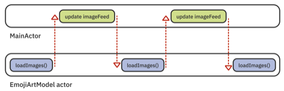

# Actors
As mentioned in the Task groups modifying objects through different threads can cause Data Races. on of the solutions is define classes as actor

```swift
actor Foo {}
//istead of 
class Foo {}
```


## MainActor
if our custom actor has some related to UI properties, like variable with `@Published` property wrapper then we need to put a `@MainActor` property wrapper to make sure it would treat this variable on the `MainActor` not the class own actor and our UI can safely use it.

if we want to modifying it in the custom actor we have to use `MainActor.run {}` to make sure our changes would execute on the `MainActor`

```swift
actor FooViewModel: ObservableObject {
	@Published @MainActor var someData: String = ""

	@MainActor func assignData() async {
		someData = "Some Data"
	}

}

struct FooView: some View {
	@StateObject var viewModel = FooViewModel()

	var body: some View {
	Text(someData)
	}
}
```

It's also can be used on **viewModel** classes like this
```swift
	@MainActor class ListViewModel: ObservableObject {
	//...
	}
```

*if we turn our class to an actor we probably gonna face some advance problems better checkout the book page 190 for seeing some tricks that we may use to fix them.*



## `nonsolated` Methods
if in our actors we have functions that **don't modify the state of actor** we can use them like `nonisolated func foo() {}`. this would act the function as a **default class function**  and some boost in our performance of the app.

## Sendable
in the swift concurrency topics it means: **safe to use in concurrent code**
* there is a Sendable protocols that some classes conforms to: like **Actors**
* there is an annotation `@Sendable` which makes closure sendable
```swift
@escaping @Sendable () async -> Void
```

🔥 The best practice in your own code is to require that any **closures** you run **asynchronously** be `@Sendable`, and that any **values** you use in **asynchronous** code adhere to the `Sendable` protocol.


## Global Actors
Same as `@MainActor` global actors getting used where we need a **single, shared actor that’s accessible from anywhere.**
for example: 

* The app’s database layer, which is usually a singleton type that manages the state of a file on disk.
* Image or data caches are also often single-instance types.
* The authentication status of the user is valid app-wide, whether they have logged in or not.

Global Actors definition is:
```Swift
@globalActor actor ImageCache {
//only thing that needed to be implement when we conform to global actor
  let shared = ImageCache() 
}

//this would always excute on image cache actor
@ImageCache func someFuncThatDealsWithCache() {
	//...
}

//we can make a class to always execute on a specific global actor like
@ImageCach class ImageCachConector {

}
```
