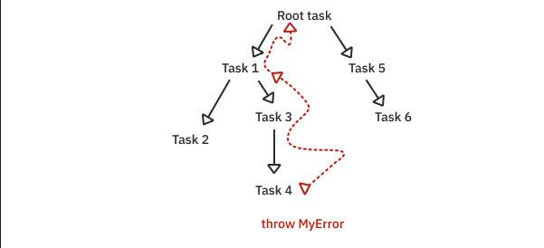
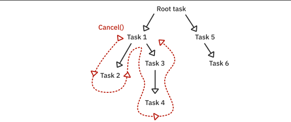

# Introduction

In a synchronous context, code runs in one execution thread on a single CPU core.
But all iOS and macOS and cocoa based apps are **asynchronous**.

In an asynchronous context, it’s hard to tell the exact order in which functions run, especially when several asynchronous functions need to use the same thread.

*New Swift concurrency APIS have replaced the GCD.*

### Some of GCD problems
* **Thread explosion**: Creating too many concurrent threads requires constantly switching between active threads. This ultimately slows down your app.
* **Priority inversion**: When arbitrary, low-priority tasks block the execution of high-priority tasks waiting in the same queue.
* **Lack of execution hierarchy**: Asynchronous code blocks lacked an execution hierarchy, meaning each task was managed independently. This made it difficult to cancel or access running tasks. It also made it complicated for a task to return a result to its caller.

### Some of the New Concurrent system benefits
* **A cooperative thread pool**
The new model transparently manages a pool of threads to ensure it doesn’t exceed the number of CPU cores available. This way, the runtime doesn’t need to create and destroy threads or constantly perform expensive thread switching. Instead, your code can suspend and, later on, resume very quickly on any of the available threads in the pool.

* **async/await syntax**

* **Structured concurrency**
Each asynchronous task is now part of a hierarchy, with a parent task and a given priority of execution. This hierarchy allows the runtime to cancel all child tasks when a parent is canceled. Furthermore, it allows the runtime to wait for all children to complete before the parent completes. It’s a tight ship all around.

* **Context-aware code compilation**
The compiler keeps track of whether a given piece of code could run asynchronously. If so, it won’t let you write potentially unsafe code, like mutating shared state.
*some features like **actors** has been built by using this.*


### Some Starter Examples

* Example of getting a response from an API call:

``` swift      
func fetchFOOs() async throws -> [String] {

 guard let url = URL(string: "http://someURL.com") else {

	 throw "Unvalid URL"

 }

 let (data, response) = try await URLSession.shared.data(from: url)

 guard (response as? HTTPURLResponse)?.statusCode == 200 else {

	 throw "unvalid response"

 }

 return try JSONDecoder().decode([FOO].self, from: data)

 }   

```  


* Example of getting a **stream** of responsed from an API call:

``` swift      
func fetchStreamOfFOOs() async throws -> [String] {

	guard let url = URL(string: "http://someURL.com") else {

	  throw "Unvalid URL"

	 }

	let (stream , response) = try await liveURLSession.bytes(from: url)


	guard (response as? HTTPURLResponse)?.statusCode == 200 else {

		 throw "Unvalid response"

	 }

	 let decoder = JSONDecoder()

	 for try await line in stream.lines {

		let sortedSymbols = try decoder.decode([SomeFoo].self,
											   from: Data(line.utf8))
		print(sortedSymbols)
	 }
}

```  

### How Error raise in tasks



### How tasks getting canceled



### Bird Eye view of async/await

* functions
```swift
func myfunc() async throws -> String {}

try await myfunc()
```

* computed properties
```swift       
var propety: String {
	get async {

	}
}

await property
```

* closures
```swift       
func myfunc((Int) async -> Int) {
	
}

func {
	return await anAsyncFunc()
}
```

### Async let

if we have to await functions like:
```swift       
let foo = try await getFoo()
let bar = try await getBar
```
`getBar()` starts after `getFoo()` finish it work. but what if we don't want to wait for `getFoo()` and run both `getFoo()` and `getBar()` in **parallel**?

by using async let like this:
```swift       
async let foo = try await getFoo()
async let bar = try await getBar

let (fooResult, barresult) = try await (foo, bar)

```

**✅  Important note:** The async code in the two calls starts executing **right away,** before you call await. 