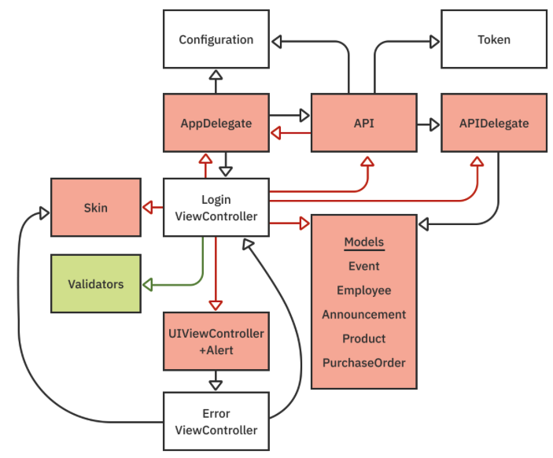

## Problematic dependencies
>Dependency maps are a way to illustrate dependencies between types. Its primary purpose is to help you understand how a change will affect an entire system. You can use dependency maps to identify change points, test points and places where you can pull out types to make your app more modular.

These are the signs of a problematic dependency in a dependency map
* Is the dependency on the `AppDelegate`? By definition, the `AppDelegate` represents the app, so it cannot be pulled into the module. Hence, it’s going to be problematic.
* Is the dependency **circular**? If so, you may need to break one or both sides.
* Does the dependency have many secondary dependencies? If so, it’s going to be difficult to pull it into the module.
* Does it make sense for the dependency to be pulled into the same module? Even if it’s possible to pull the dependency into the same module, it may not be appropriate to do so
**Example**
