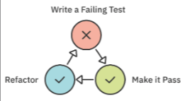

Test-driven development, or TDD, is an iterative way to create software by **making many small changes** backed by **tests**

## TDD Cycle



* **Write a failing test**
*  **Make the test pass**
	Write the **minimum** amount of code to make the test pass
* **Refactor**
	Clean up test(s) and code as needed (refactor).
* **Repeat**
	Repeat the process until you cover all the logic cases.


## Naming Tests

``` Swift
func testAppModel_whenStarted_isInInProgressState() {}
```

1) All tests must begin with `test`.
2) `AppModel` This says an AppModel is the system under test (sut).
3) `whenStarted` is the condition or state change that is the catalyst for the test.
4) `isInInProgressState` is the assertion about what the sut’s state should be after the when
