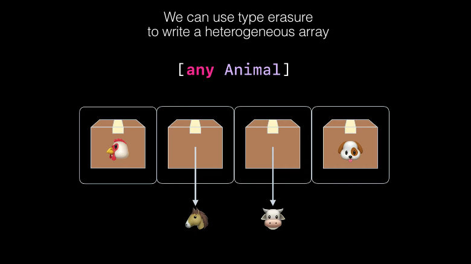

>The ability of abstract code to behave differently for different concrete types is called **polymorphism**

## different between `some` and `any`
`some protocol` represent a specific type that conforms to the protocol but `any Protocol` mean different types that conforms to the protocol.

```swift
	struct A: Protocol {}
	struct B: Protocol {}

	func foo(_a: [some Protocol]) {
	}

	foo([A(), B()])
	// 🔴 A Type is not the same type of B

	func bar(_ a: [any Protocol]) {
	}
	
	bar([A(), B()])
	//🟢
```

```swift
func foo(_ a: Int) -> some Protocol {
	// 🔴 A and B do not having a same type
	if (a > 10) {
	return A()
	} else {
	return B()
	}
}
```

**some**
* Holds a fixed concrete type
* Guarantees type relationships

**any**
* Holds an arbitrary concrete type
* Erases type relationships

> in general write some by default and change to any when you need to store arbitrary values


## `any` memory handling
> Existential types provide type erasers


*if it's not fixed in that box then box gonna have a pointer to it*

[Original Video 🎥](https://developer.apple.com/videos/play/wwdc2022/110352/)