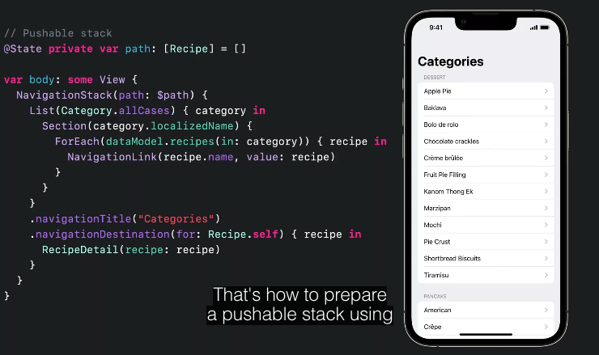
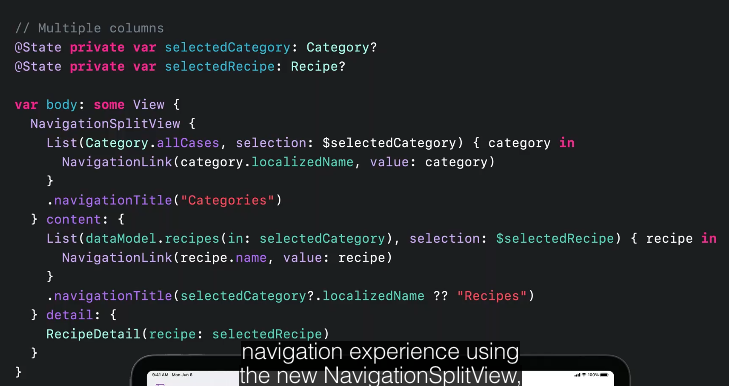
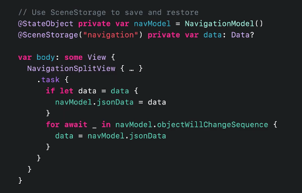

## Navigation Stack
represent push/pop interface
```swift
// path: binding of all the paths that pushed to the stack
NavigationStack(path: $path) {
	NavigationLinks("Details", value: value)

	.navigationDestination(for:) { item in
		//some View
	}
}

```


## NavigationSplitView
For multicolumn apps
If `content` provided its gonna be a three column otherwise it's a two column split view
```swift
NavigationSplitView() {
					   
}
//is optional
content: {
		  
}detail: {
		 
}
```

* Navigation Split View would automatically turned to Navigation Stack View on iPhone *works on all platforms*()

this aproach also works. notice how we use NavigationStack inside of Navigation Split View. we don't need those list selection like previouse example instead we use a NavigationStack in details
```swift
//two column
NavigationSplitView() {
	//list of side rows					   
}
}detail: {
	NavigationStack() {
	}
}
```

## Persist Navigation State
1) Move navigation state into a model type (`ObservableObject`)
2) Make the navigation model `Codable` (avoid storing unnecessarily infos)
3) Use `SceneStorsge` to save and restore

#### Important Note
*better to use Navigation Split views wherever we could. even if programming for iPhones*

<hr>
[Original Video 🎥](https://developer.apple.com/videos/play/wwdc2022/10054/)