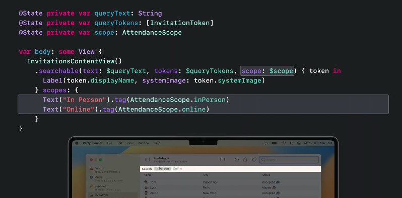

* Swift Charts 
```swift
Chart(data) { task in
	BarMark(x:, y:)
	//or
	LineMark(x:, y:) 
}
```
## Navigation Views
### Navigation Stack
Destinations are now Data Driven:
```swift
//assume item is Foo type
NavigationStack {
	NavigationLink(value: item) { Label() }
}
.navigationDestination(for: Foo.self) { item in
//return coresponding view ...
}
```
NavigationStack could use `path` parameter to save stack state in an array.
  
### Navigation Split View
>great for value based navigations
```swift
NavigationSplitView {
	//list of bar leading items
} detail: {
	//trailing view for each of items.
}
```
### UIScene API
* windows (mostly for macos)
* MenuBarExtra (building menu bar apps in macOS)

## Forms
* LabledContent
* Toggle Lables switchings

## Controls
* improvements on line limit of TextField
* DisclocureGroup

* Tables
	```swift
	Table(data) {
		TableColumn() { item in
			SomeSampleRow(item)
		}
	}
```
* contentMenu for tables 
	```swift
	Table() {...}.contextMenu() {....}
```

* custom Toolbars
* search scopes
	```swift
	var body: some View {
	//... spme views
	.searchable(text:, scope:)
	
	}
```

## Sharing
* `PhotosPicker()`
* `ShareLink()`
* Transferable
	???? (Meet Transferable talk)

## Graphics
* Shape Styles
* shadowStyle
* color.gradient
* text can get animated based on fonts and style with `withAnimation()`
* Grid, Layout (watch Compose custom layout with SwiftUI)

<hr>
[Original Video 🎥](https://developer.apple.com/videos/play/wwdc2022/10052/)